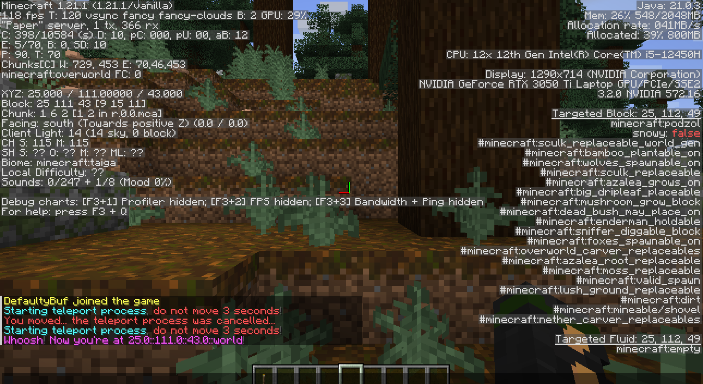

# 🪶 What is FeatherToolkit?

FeatherToolkit is a lightweight framework designed to streamline the development of Spigot plugins.
It provides essential utilities, abstractions, and a structured approach to common plugin tasks, reducing boilerplate code and improving maintainability.
With built-in support for configuration management, command handling, and event processing, FeatherToolkit enables developers to focus on core gameplay features rather than low-level implementation details.

# 🪶 How to FeatherToolkit

## Table of Contents

- [⚙️ 1. How to setup a project](https://github.com/TheAncientOwl/feather-toolkit?tab=readme-ov-file#%EF%B8%8F-1-how-to-setup-a-project)
  - [⚙️ 1.1. Setup 🪶Quill and 🧰FeatherToolkit](https://github.com/TheAncientOwl/feather-toolkit?tab=readme-ov-file#%EF%B8%8F-11-setup-quill-and-feathertoolkit)
  - [🗂️ 1.2. Create project](https://github.com/TheAncientOwl/feather-toolkit?tab=readme-ov-file#%EF%B8%8F-12-create-project--feather-showcaseb6c90c1)
  - [⚙️ 1.3. Configure maven project](https://github.com/TheAncientOwl/feather-toolkit?tab=readme-ov-file#%EF%B8%8F-13-configure-maven-project)
- [🐆 2. How to run a project](https://github.com/TheAncientOwl/feather-toolkit?tab=readme-ov-file#-2-how-to-run-a-project)
  - [🔧 2.1. Install](https://github.com/TheAncientOwl/feather-toolkit?tab=readme-ov-file#-21-install)
  - [🐆 2.2. Run the server](https://github.com/TheAncientOwl/feather-toolkit?tab=readme-ov-file#-22-run-the-server)
- [🏛️ 3. Project architecture](https://github.com/TheAncientOwl/feather-toolkit?tab=readme-ov-file#%EF%B8%8F-3-project-architecture)
  - [🪜 3.1. Directory hierarchy](https://github.com/TheAncientOwl/feather-toolkit?tab=readme-ov-file#-31-directory-hierarchy)
  - [🪶 3.2. What's behind FeatherToolkit?](https://github.com/TheAncientOwl/feather-toolkit?tab=readme-ov-file#-32-whats-behind-feathertoolkit)
  - [⚙️ 3.3. Modules configuration @ `src/main/resources/feather-toolkit-config.yml`](https://github.com/TheAncientOwl/feather-toolkit?tab=readme-ov-file#%EF%B8%8F-33-modules-configuration--srcmainresourcesfeather-toolkit-configyml)
  - [🪶 3.4. Quill project @ `quill.json`](https://github.com/TheAncientOwl/feather-toolkit?tab=readme-ov-file#-34-quill-project--quilljson)
- [🛠️ 4. Development](https://github.com/TheAncientOwl/feather-toolkit?tab=readme-ov-file#4-development)
  - [✨ 4.1. Teleport module](https://github.com/TheAncientOwl/feather-toolkit?tab=readme-ov-file#-41-teleport-module--feather-showcase879c769)
    - [4.1.1. Setup directories and files](https://github.com/TheAncientOwl/feather-toolkit?tab=readme-ov-file#411-setup-directories-and-files)
    - [4.1.2. ITeleport.java](https://github.com/TheAncientOwl/feather-toolkit?tab=readme-ov-file#412-iteleportjava)
    - [4.1.3. TeleportModule.java](https://github.com/TheAncientOwl/feather-toolkit?tab=readme-ov-file#413-teleportmodulejava)
    - [4.1.4. StartTeleportCommand.java](https://github.com/TheAncientOwl/feather-toolkit?tab=readme-ov-file#414-startteleportcommandjava)
    - [4.1.5. PlayerCancelTpOnMoveListener.java](https://github.com/TheAncientOwl/feather-toolkit?tab=readme-ov-file#415-playercanceltponmovelistenerjava)
    - [4.1.6. Run and test!](https://github.com/TheAncientOwl/feather-toolkit?tab=readme-ov-file#416-run-and-test)
  - [✨ 4.2. Dummy module](https://github.com/TheAncientOwl/feather-toolkit?tab=readme-ov-file#-42-dummy-module--feather-showcase879c769)
    - [4.2.1. Setup directories and files](https://github.com/TheAncientOwl/feather-toolkit?tab=readme-ov-file#421-setup-directories-and-files)
    - [4.2.2. IDummy.java](https://github.com/TheAncientOwl/feather-toolkit?tab=readme-ov-file#422-idummyjava)
    - [4.2.3. DummyModule.java](https://github.com/TheAncientOwl/feather-toolkit?tab=readme-ov-file#423-dummymodulejava)
    - [4.2.4. PlayerRightClickRedWoolListener.java](https://github.com/TheAncientOwl/feather-toolkit?tab=readme-ov-file#424-playercanceltponmovelistenerjava)
    - [4.2.5. Run and test!](https://github.com/TheAncientOwl/feather-toolkit?tab=readme-ov-file#425-run-and-test)
- [🧪 5. Unit Testing & Code Coverage](#-5-unit-testing--code-coverage)
  - [5.1. How to run unit tests](#51-how-to-run-unit-tests)
  - [5.2. How to run unit test coverage](#52-how-to-run-unit-test-coverage)
  - [5.3. Teleport module unit tests](#53-teleport-module-unit-tests)
- [📜 License](#-license)
- [🔗 Related Projects](#-related-projects)

## 📖 What are we gonna learn?

- how to setup, develop and run a feather-toolkit project;
- how feather-toolkit is designed to simplify what you have to do while developing plugins;
- how feather-toolkit modules can interact one another.

## 🗂️ Case study

This tutorial covers how to use feather-toolkit in order to develop a basic plugin with: `interfaces`, `components` / `modules`, `commands` and `listeners`.
We're gonna develop a simple plugin that can teleport a player on command if the player doesn't move for 3 seconds. _that can be found [here](https://github.com/TheAncientOwl/feather-showcase)_ :)

# ⚙️ 1. How to setup a project

## ⚙️ 1.1. Setup [🪶Quill](https://github.com/TheAncientOwl/quill) and [🧰FeatherToolkit](https://github.com/TheAncientOwl/feather-toolkit/releases)

First of all, you will need to have **Quill CLI tool** installed. More on how to setup it can be found [here](https://google.ro).

Now, let's install a toolkit version to use alongside our showcase plugin.
Release versions of FeatherToolkit can be found [here](https://github.com/TheAncientOwl/feather-toolkit/releases). _I do recommend using latest releases to get the best out of it._

```bash
$ quill --install-toolkit v1.0.1
```


## 🗂️ 1.2. Create project ~ [feather-showcase@b6c90c1](https://github.com/TheAncientOwl/feather-showcase/commit/b6c90c130625a92af2ebbf2d67a94b031868cd79)

Now, let's create our first project, shall we?
[_**Quill**_](https://github.com/TheAncientOwl/quill) will setup a maven project and configure it with everything needed to start working on your dream plugins.

```bash
$ mkdir feather-showcase
$ cd feather-showcase
$ quill --init
```

Next you will be asked to specify the main package of the project and the plugin name. The plugin name should use pascal case. It will eventually be converted to lowercase and added as final package to the specified one.


## ⚙️ 1.3. Configure maven project

As we've seen in the previous step, a maven project was created.
We can configure it running quill as follows:

```bash
$ quill --configure
```


# 🐆 2. How to run a project

## 🔧 2.1. Install

First of all, we have to `install` the plugin into the `dev/server/plugins`, so the paper server knows how to load it.
For that, we can run:

```bash
$ quill --install
$ ls ./dev/server/plugins
```


## 🐆 2.2. Run the server

```bash
$ quill_run_server.sh
```


# 🏛️ 3. Project architecture

## 🪜 3.1. Directory hierarchy

- `src/main/java/dev/theancientowl/feathershowcase`: plugin java logics

- `src/main/resources`: plugin resources. _We will have a deeper look at it later._

- `src/test/java/dev/theancientowl/feathershowcase`: plugin java unit tests, _**because**
  **Q:** what's better than code?
  **A:** Code that works :)
  **Q:** And how do we know it works?
  **A:** We let the user test it!!... I... I mean we write unit tests! Right? right...?_
- `dev/server`: contains your usual paper server setup with `paper-version.jar` alongside scripts for running the server on linux (`start.sh`) or windows (`start.ps1`).
  _No need to manually call those scripts, since we've covered how to run the server at step 2.2._

- `project`: resources to override the styles of the unit tests code coverage report to make it dark themed and the google-style java formatting rules.

- `pom.xml`: the classic maven project configuration file, adapted with _[FeatherToolkit](https://github.com/TheAncientOwl/feather-toolkit)_, _[JUnit](https://junit.org/junit5/)_ and _[Mockito](https://site.mockito.org/)_.

- `quill.json`: the configuration file of _[Quill CLI tool](https://github.com/TheAncientOwl/quill)_ for this specific project. _We will have a deeper look at it later._

## 🪶 3.2. What's behind FeatherToolkit?

Entry point: [`src/main/java/dev/defaultybuf/feather/toolkit/core/FeatherPlugin.java`](https://github.com/TheAncientOwl/feather-toolkit/blob/main/src/main/java/dev/defaultybuf/feather/toolkit/core/FeatherPlugin.java)

- The toolkit structures each component of the plugin in modules.
- A module usually contains `commands`, `components`, `listeners`, `interfaces` and `events`.
  In fact, **the core logic of the module** should be found in `components`, and its `API` should be located within `interfaces`.
  From now on, we will refer to `components` as `modules`, even though we know that `modules` also contain other stuff as well.
- Each `command`/`module`/`listener` has access to any other module => we have dependencies between modules.
  Here sits the logics of your plugin, be it `bukkit`/`spigot`/`paper` **API** calls or algorithms that suit your case.
- All modules will be enabled when the plugin first runs.
- How does [FeatherToolkit](https://github.com/TheAncientOwl/feather-toolkit) know in which order to enable the modules?
  That's quite simple! All modules have to be configured in `src/main/resources/feather-toolkit-config.yml`.
  On plugin enable, the `ModulesManager` performs a [topological sort](https://en.wikipedia.org/wiki/Topological_sorting) on the dependency graph to figure out the order and then enables the modules.
- To be able to use the _[Quill CLI tool]()_, the project has a `quill.json` configuration file.

## ⚙️ 3.3. Modules configuration @ `src/main/resources/feather-toolkit-config.yml`

As we have seen in 3.2., the plugin logic is split between modules.
In feather-toolkit we can configure modules, interfaces, commands and listeners.
A general module configuration looks like this:

```yaml
# feather-toolkit-config.yml
modules:
    ModuleConfigName:
        class: module.package.components.ModuleMainComponent
        interfaces:
            - module.package.interfaces.IModuleInterface01
            - module.package.interfaces.IModuleInterface02
            ...
        dependencies: [*other module config names*]
        mandatory: true
        config: path/to/config.yml
        commands:
            command-name01: module.package.commands.Command01
            command-name02: module.package.commands.Command02
            ...
        listeners:
            - module.package.listeners.Listener01
            - module.package.listeners.Listener02
            ...
```

Each module has it own configuration section:

- `class`: java class of main module component
- `interfaces`: list of java classes representing the interfaces of the module
- `dependencies`: list of other module config names to help choosing the modules enable order at plugin start
- `mandatory`: boolean; if `true` the module will be enabled forcefully, otherwise the module can be toggled off by the user in the configuration file `enabled-modules.yml`
- `config`: path to module configuration file; if null, no config file will be created
- `commands`: list of java classes representing the commands related to the module
- `listeners`: list of java classes representing the listeners related to the module

By default each [FeatherToolkit]() project has 3 modules:

- `LanguageManager`: to allow multiple translations for plugin messages
- `PlayersData`: to manage the prefered language of the player. The data will be stored in `language/default-storage.yml`
- `ReloadModule`: to reload modules configurations

## 🪶 3.4. Quill project @ `quill.json`

The project configuration file for [Quill CLI tool](https://github.com/TheAncientOwl/quill). More on what's in there can be found [here](https://github.com/TheAncientOwl/quill).

# 🛠️ 4. Development

## ✨ 4.1. Teleport module ~ [feather-showcase@879c769](https://github.com/TheAncientOwl/feather-showcase/commit/879c769b30297096b6198ff5383a459b9b408da8)

Module that teleports a player to some coordinates.

### Scenario:

- the player issues `/teleport [x] [y] [z] [world]`
- after issuing the teleport command, the player shouldn't move for `3 seconds` in order to get teleported

### How do we map this to [FeatherToolkit](https://github.com/TheAncientOwl/feather-toolkit)?

- `interfaces`: `ITeleport.java` that offers
  - `startTeleport(player, x, y, z, world)`
  - `cancelTeleport(player)`
- `components`: `TeleportModule.java` that implements `ITeleport` and handles the cooldown and teleport
- `commands`: `StartTeleportCommand.java` that calls the API of `ITeleport` to start a teleport
- `listeners`: `PlayerCancelTpOnMoveListener.java` that calls the API of `ITeleport` to cancel the teleport if the player moved

## 4.1.1. Setup directories and files

### >> Create logics files

```bash
# from project root
$ cd ./src/main/java/dev/theancientowl/feathershowcase/modules
$ mkdir teleport && cd teleport
$ mkdir components interfaces commands listeners
$ touch components/TeleportModule.java interfaces/ITeleport.java commands/StartTeleportCommand.java listeners/PlayerCancelTpOnMoveListener.java
```


## >> Add the module configuration file

```bash
# from project root
$ echo "wait-time: 3s" > ./src/main/resources/modules/teleport.yml
```

## >> Add module messages to `src/main/resources/language/en.yml`

```yaml
general: ...
language: ...
configuration: ...

teleport:
  start-teleporting: '&bStarting teleport process&8, &cdo not move 3 seconds&8!'
  teleport-cancelled: '&cYou moved... the teleport process was cancelled...'
  executed: "&dWhoosh&8! &dNow you're at {x}::{y}::{z}::{world}&8!"
  invalid-number: '&c{string} is not a valid number&8...'
  invalid-world: '&c{string} is not a valid world&8...'
```

## >> Register module commands in `src/main/resources/plugin.yml`

```yaml
commands:
  language: ...
  feather-reload: ...
  teleport:
```

## >> Update toolkit config in `src/main/resources/feather-toolkit-config.yml`

_Usually this is configured towards the end, but we're gonna do it now to speed things up a little bit._

```yaml
modules:
    ...
    TeleportModule:
        class: dev.theancientowl.feathershowcase.modules.teleport.components.TeleportModule
        interfaces:
            - dev.theancientowl.feathershowcase.modules.teleport.interfaces.ITeleport
        dependencies: [LanguageManager]
        mandatory: true
        config: modules/teleport.yml
        commands:
            teleport: dev.theancientowl.feathershowcase.modules.teleport.commands.StartTeleportCommand
        listeners:
            - dev.theancientowl.feathershowcase.modules.teleport.listeners.PlayerCancelTpOnMoveListener

```

## 4.1.2. `ITeleport.java`

```java
package dev.theancientowl.feathershowcase.modules.teleport.interfaces;

import org.bukkit.World;
import org.bukkit.entity.Player;

/**
 * @brief TeleportModule interface
 */
public interface ITeleport {
    public void startTeleport(Player player, double x, double y, double z, World world);

    public void cancelTeleport(Player player);

}
```

## 4.1.3. `TeleportModule.java`

```java
package dev.theancientowl.feathershowcase.modules.teleport.components;

import java.util.HashMap;
import java.util.List;
import java.util.Map;
import java.util.UUID;

import org.bukkit.Bukkit;
import org.bukkit.Location;
import org.bukkit.World;
import org.bukkit.entity.Player;

import dev.defaultybuf.feather.toolkit.api.FeatherModule;
import dev.defaultybuf.feather.toolkit.core.Placeholder;
import dev.defaultybuf.feather.toolkit.exceptions.FeatherSetupException;
import dev.defaultybuf.feather.toolkit.util.java.Clock;
import dev.defaultybuf.feather.toolkit.util.java.Pair;
import dev.theancientowl.feathershowcase.modules.teleport.interfaces.ITeleport;

/**
 * @brief Module responsible for managing teleports on the server
 * @extends FeatherModule - in order to be managed by the toolkit
 * @implements ITeleport - module interface
 */
public class TeleportModule extends FeatherModule implements ITeleport {

    public static final record TeleportData(Player player, Location location, long issuedTime) {
    }

    private Map<UUID, TeleportData> teleports = null;

    public TeleportModule(InitData data) {
        super(data);
    }

    /**
     * @brief Method that will be run when the plugin is enabled.
     *        Useful for setting up internal data, running tasks, connecting to databases, etc.
     */
    @Override
    protected void onModuleEnable() throws FeatherSetupException {
        teleports = new HashMap<>();

        // Run a task every config:wait-time ticks to check if any teleport can be executed
        Bukkit.getScheduler().runTaskTimerAsynchronously(getPlugin(), new TeleportChecker(this), 0,
                getConfig().getTicks("wait-time"));
    }

    /**
     * @brief Add teleport data into internal data structure.
     * @param player
     * @param x
     * @param y
     * @param z
     * @param world
     */
    @Override
    public void startTeleport(Player player, double x, double y, double z, World world) {
        this.teleports.put(player.getUniqueId(),
                new TeleportData(player, new Location(world, x, y, z), Clock.currentTimeMillis()));
        getLanguage().message(player, "teleport.start-teleporting");
    }

    /**
     * @brief Remove player's teleport data from internal data structure.
     * @param player
     */
    @Override
    public void cancelTeleport(Player player) {
        if (this.teleports.containsKey(player.getUniqueId())) {
            this.teleports.remove(player.getUniqueId());
            getLanguage().message(player, "teleport.teleport-cancelled");
        }
    }

    /**
     * @brief Teleport the player and send him a message with the coordinates.
     * @param data Teleport data to execute
     */
    private void executeTeleport(TeleportData data) {
        data.player.teleport(data.location);

        getLanguage().message(data.player, "teleport.executed", List.of(
                Pair.of(Placeholder.X, data.location.getX()),
                Pair.of(Placeholder.Y, data.location.getY()),
                Pair.of(Placeholder.Z, data.location.getZ()),
                Pair.of(Placeholder.WORLD, data.location.getWorld().getName())));
    }

    /**
     * @brief Task to be run every config:wait-time ticks in order to execute teleports.
     */
    private static class TeleportChecker implements Runnable {
        // Save a reference to the module in order to access its data.
        private final TeleportModule teleportModule;

        public TeleportChecker(TeleportModule teleportModule) {
            this.teleportModule = teleportModule;
        }

        /**
         * @brief Iterate over module teleports and
         *        execute those that were issued config:wait-time milliseconds ago.
         */
        @Override
        public void run() {
            final var currentTime = Clock.currentTimeMillis();
            final var teleportWaiting = this.teleportModule.getConfig().getMillis("wait-time");

            final var iterator = this.teleportModule.teleports.entrySet().iterator();
            while (iterator.hasNext()) {
                final var entry = iterator.next();
                if (entry.getValue().issuedTime + teleportWaiting < currentTime) {
                    Bukkit.getScheduler().runTask(this.teleportModule.getPlugin(), () -> {
                        this.teleportModule.executeTeleport(entry.getValue());
                    });
                    iterator.remove();
                }
            }
        }
    }

}
```

## 4.1.4. `StartTeleportCommand.java`

```java
package dev.theancientowl.feathershowcase.modules.teleport.commands;

import java.util.ArrayList;
import java.util.List;

import org.bukkit.World;
import org.bukkit.command.CommandSender;
import org.bukkit.entity.Player;

import dev.defaultybuf.feather.toolkit.api.FeatherCommand;
import dev.defaultybuf.feather.toolkit.core.Placeholder;
import dev.defaultybuf.feather.toolkit.util.java.Pair;
import dev.defaultybuf.feather.toolkit.util.java.StringUtils;
import dev.defaultybuf.feather.toolkit.util.parsing.Args;
import dev.theancientowl.feathershowcase.modules.teleport.interfaces.ITeleport;

/**
 * @brief Command responsible for creating teleport module data
 * @extends FeatherCommand in order to be managed by the toolkit
 */
public class StartTeleportCommand extends FeatherCommand<StartTeleportCommand.CommandData> {

    public StartTeleportCommand(InitData data) {
        super(data);
    }

    /**
     * @brief Data that is parsed from command args and then executed
     */
    public static record CommandData(Player player, double x, double y, double z, World world) {
    }

    /**
     * @brief Check if the sender can issue this command
     * @param sender Who issued the command: console / player
     * @param data   parsed by StartTeleportCommand::parse(CommandSender,
     *               String[])
     * @return true if the sender has permission to execute this command, false
     *         otherwise
     */
    @Override
    protected boolean hasPermission(CommandSender sender, CommandData data) {
        return sender instanceof Player && sender.hasPermission("feather-showcase.teleport");
    }

    /**
     * @brief Execute command data parsed by
     *        StartTeleportCommand::parse(CommandSender, String[])
     * @param sender Who issued the command: console / player
     * @param data   parsed by StartTeleportCommand::parse(CommandSender,
     *               String[])
     */
    @Override
    protected void execute(CommandSender sender, CommandData data) {
        // To access any other module, getInterface(Class) can be used.
        // Here TeleportModule was registered as ITeleport,
        // hence we're using it this way to access module API:
        getInterface(ITeleport.class).startTeleport(data.player, data.x, data.y, data.z, data.world);
    }

    /**
     * @brief Parse command args from "/teleport x y z world"
     * @note For simplicity we're gonna assume that the player is alywas sending the
     *       correct number of arguments. In practice we should check it :)
     * @param sender Who issued the command: console / player
     * @param args   command args
     * @return parsed command data if parsing was succesful, null otherwise
     */
    @Override
    protected CommandData parse(CommandSender sender, String[] args) {
        CommandData outData = null;

        // Args.parse takes in the string arguments and a list of parsers corresponding
        // to each argument in order.
        // For this command we know that first 3 args should be of type Double, and the
        // 4th should be World.
        // You can pass any other method that takes a string and returns your specific
        // object.
        var parsedArgs = Args.parse(args, Args::getDouble, Args::getDouble, Args::getDouble, Args::getWorld);

        if (parsedArgs.success()) {
            outData = new CommandData(
                    (Player) sender,
                    parsedArgs.getDouble(0),
                    parsedArgs.getDouble(1),
                    parsedArgs.getDouble(2),
                    parsedArgs.getWorld(3));
        } else {
            switch (parsedArgs.failIndex()) {
                case 0:
                case 1:
                case 2:
                    getLanguage().message(sender, "teleport.invalid-number",
                            Pair.of(Placeholder.STRING, args[parsedArgs.failIndex()]));
                    break;
                case 3:
                    getLanguage().message(sender, "teleport.invalid-world", Pair.of(Placeholder.STRING, args[3]));
                    break;
                default:
                    break;
            }
        }

        return outData;
    }

    /**
     * @brief Return tab completions based on command args
     * @param args
     * @return List of tab completions
     */
    @Override
    protected List<String> onTabComplete(String[] args) {
        List<String> completions = new ArrayList<>();

        switch (args.length) {
            case 1:
                completions.add("x");
                break;
            case 2:
                completions.add("y");
                break;
            case 3:
                completions.add("z");
                break;
            case 4:
                completions = StringUtils.filterStartingWith(StringUtils.getWorlds(), args[3]);
                break;
            default:
                break;
        }

        return completions;
    }

}
```

## 4.1.5. `PlayerCancelTpOnMoveListener.java`

```java
package dev.theancientowl.feathershowcase.modules.teleport.listeners;

import org.bukkit.event.EventHandler;
import org.bukkit.event.player.PlayerMoveEvent;

import dev.defaultybuf.feather.toolkit.api.FeatherListener;
import dev.theancientowl.feathershowcase.modules.teleport.interfaces.ITeleport;

/**
 * @brief Listener responsible for canceling teleports if the player moves.
 * @extends FeatherListener in order to be managed by the toolkit
 */
public class PlayerCancelTpOnMoveListener extends FeatherListener {

    public PlayerCancelTpOnMoveListener(InitData data) {
        super(data);
    }

    /**
     * @brief When the player moves, call module API to cancel the teleport
     * @param event
     */
    @EventHandler
    public void onPlayerMove(PlayerMoveEvent event) {
        if (event.isCancelled()) {
            return;
        }

        // To access any other module, getInterface(Class) can be used.
        // Here TeleportModule was registered as ITeleport,
        // hence we're using it this way to access module API:
        getInterface(ITeleport.class).cancelTeleport(event.getPlayer());
    }

}
```

## 4.1.6. Run and test!

```bash
# from project root

# install the plugin
$ quill --install

# run the dev server
$ quill_run_server.sh
```


### >> Issue teleport command


### >> Cancel the teleport request by moving


### >> Do not move and wait 3 seconds to be teleported



## ✨ 4.2. Dummy module ~ [feather-showcase@bd83e0c](https://github.com/TheAncientOwl/feather-showcase/commit/bd83e0c442ca9930ad0c6afa5b85fd478960108d)

Now let's see how we can access the `TeleportModule` from another one!
This module cancels a player teleport **when the player right clicks red wool block** _hahaha..._.

### Scenario:

- when the player right clicks a red wool block, call `ITeleport.cancelTeleport(...)`

### How do we map this to [FeatherToolkit](https://github.com/TheAncientOwl/feather-toolkit)?

- `interfaces`: `IDummy.java` that does nothing :)
- `components`: `DummyModule.java` that implements `IDummy` and does nothing
- `listeners`: `PlayerRightClickRedWoolListener.java` that calls the API of `ITeleport` to cancel the teleport if the player right clicked red wool block

## 4.2.1. Setup directories and files

### >> Create logics files

```bash
# from project root
$ cd ./src/main/java/dev/theancientowl/feathershowcase/modules
$ mkdir dummy && cd dummy
$ mkdir components interfaces listeners
$ touch components/DummyModule.java interfaces/IDummy.java listeners/PlayerRightClickRedWoolListener.java
```


## >> Update toolkit config in `src/main/resources/feather-toolkit-config.yml`

_Usually this is configured towards the end, but we're gonna do it now to speed things up a little bit._

```yaml
modules:
    ...
    DummyModule:
        class: dev.theancientowl.feathershowcase.modules.dummy.components.DummyModule
        interfaces:
            - dev.theancientowl.feathershowcase.modules.dummy.interfaces.IDummy
        dependencies: [TeleportModule]
        mandatory: true
        config: null
        commands: []
        listeners:
            - dev.theancientowl.feathershowcase.modules.dummy.listeners.PlayerRightClickRedWoolListener

```

## 4.2.2. `IDummy.java`

```java
package dev.theancientowl.feathershowcase.modules.dummy.interfaces;

/**
 * @brief Dummy module interface
 */
public interface IDummy {
}
```

## 4.2.3. `DummyModule.java`

```java
package dev.theancientowl.feathershowcase.modules.dummy.components;

import dev.defaultybuf.feather.toolkit.api.FeatherModule;
import dev.theancientowl.feathershowcase.modules.dummy.interfaces.IDummy;

/**
 * @brief Module responsible for issuing teleports
 *        when the player right clicks a red wool block :)
 * @extends FeatherModule - in order to be managed by the toolkit
 * @implements IDummy - module interface
 */
public class DummyModule extends FeatherModule implements IDummy {

    public DummyModule(InitData data) {
        super(data);
    }

}
```

## 4.2.4. `PlayerRightClickRedWoolListener.java`

```java
package dev.theancientowl.feathershowcase.modules.dummy.listeners;

import org.bukkit.Material;
import org.bukkit.block.Block;
import org.bukkit.event.EventHandler;
import org.bukkit.event.block.Action;
import org.bukkit.event.player.PlayerInteractEvent;

import dev.defaultybuf.feather.toolkit.api.FeatherListener;
import dev.theancientowl.feathershowcase.modules.teleport.interfaces.ITeleport;

/**
 * @brief Listener responsible for canceling teleports
 *        if the player right clicks a red wool block :)
 * @extends FeatherListener in order to be managed by the toolkit
 */
public class PlayerRightClickRedWoolListener extends FeatherListener {

    public PlayerRightClickRedWoolListener(InitData data) {
        super(data);
    }

    /**
     * @brief Call TeleportModule API to cancel the teleport request
     *        when the player right clicks red wool block
     * @param event
     */
    @EventHandler
    void onPlayerRightClickRedWool(PlayerInteractEvent event) {
        if (event.getAction() == Action.RIGHT_CLICK_BLOCK) {
            Block block = event.getClickedBlock();
            if (block != null && block.getType() == Material.RED_WOOL) {
                getInterface(ITeleport.class).cancelTeleport(event.getPlayer());
            }
        }
    }

}

```

## 4.2.5. Run and test!

```bash
# from project root

# install the plugin
$ quill --install

# run the dev server
$ quill_run_server.sh
```


### >> Issue teleport command


### >> Right click the red wool block to cancel it

#### _Notice the message from the teleport module as if we moved, even though we just right clicked the red wool block :)_


# 🧪 5. Unit Testing & Code Coverage

## 5.1. How to run unit tests

### >> Run `All` unit tests

```bash
$ quill -t
```


### >> Run `Package` unit tests

```bash
$ quill -t src/main/java/dev/theancientowl/feathershowcase/common
```


### >> Run `Specific` units

```bash
$ quill -t src/test/java/dev/theancientowl/feathershowcase/common/MessageTest.java
```


## 5.2. How to run unit tests coverage

```bash
$ quill -k
```

The coverage report can be find under `target/site/jacoco/index.html`


### `target/site/jacoco/index.html`


As you can see, the project has _nearly_ `0` lines covered by unit tests. We're gonna change that in next chapters :)
You can access the links to go through source files and see which lines and branches are covered or not.

## 5.3. Teleport module unit tests

### 5.3.1. ModulesDependencyFactory.java

First of all, we have to create a generator class that can provide real / mocked modules to be stored as dependencies for each test.
For the scope of this tutorial we will place in the common directory in the test hierarchy.

```java
package dev.theancientowl.feathershowcase.common;

import dev.defaultybuf.feather.toolkit.testing.DependencyHelper;
import dev.defaultybuf.feather.toolkit.testing.annotations.DependencyFactory;
import dev.theancientowl.feathershowcase.modules.teleport.components.TeleportModule;
import dev.theancientowl.feathershowcase.modules.teleport.interfaces.ITeleport;

/*
 * @brief Factory class of plugin real/mocked modules
 * @see DependencyHelper API
 */
public final class ModulesDependencyFactory {

    @DependencyFactory(of = ITeleport.class)
    public static final DependencyHelper<TeleportModule> getPlayersDataFactory() {
        return new DependencyHelper<TeleportModule>(
                TeleportModule.class, // module class
                ITeleport.class, // module interface
                "Teleport", // module name
                "teleport"); // module directory for real module if data files are needed
    }

}
```

### 5.3.2. TeleportModuleTest.java

```java
package dev.theancientowl.feathershowcase.modules.teleport.components;

import static org.junit.jupiter.api.Assertions.assertDoesNotThrow;
import static org.mockito.ArgumentMatchers.any;
import static org.mockito.ArgumentMatchers.anyList;
import static org.mockito.ArgumentMatchers.anyString;
import static org.mockito.ArgumentMatchers.eq;
import static org.mockito.Mockito.clearInvocations;
import static org.mockito.Mockito.doAnswer;
import static org.mockito.Mockito.verify;
import static org.mockito.Mockito.verifyNoInteractions;
import static org.mockito.Mockito.when;

import org.bukkit.Bukkit;
import org.bukkit.Location;
import org.bukkit.World;
import org.bukkit.entity.Player;
import org.bukkit.plugin.java.JavaPlugin;
import org.bukkit.scheduler.BukkitScheduler;
import org.junit.jupiter.api.BeforeEach;
import org.junit.jupiter.api.Test;
import org.mockito.Mock;
import org.mockito.MockedStatic;

import dev.defaultybuf.feather.toolkit.testing.FeatherModuleTest;
import dev.defaultybuf.feather.toolkit.testing.annotations.InjectDependencies;
import dev.defaultybuf.feather.toolkit.testing.annotations.StaticMock;
import dev.defaultybuf.feather.toolkit.util.java.Clock;
import dev.theancientowl.feathershowcase.common.ModulesDependencyFactory;

/**
 * @brief Main class for TeleportModule tests. We need to @see InjectDependencies with our
 *        ModulesDependencyFactory.
 */
@InjectDependencies(factories = {ModulesDependencyFactory.class})
class TeleportModuleTest extends FeatherModuleTest<TeleportModule> {
    // TeleportModule API needs Player, World and BukkitScheduler objects in order to work,
    // so we will use mocks instead of real objects.
    @Mock Player mockPlayer;
    @Mock World mockWorld;
    @Mock BukkitScheduler mockedScheduler;

    // Since we are using the current time in our logics, in order to test that
    // the behavior is correct, the posibility to change 'current time' on demand
    // will be necessary, hence we are using a static mock of our Clock.
    @StaticMock(of = Clock.class) MockedStatic<Clock> mockedClock;

    // Used to mock the Bukkit API our module uses.
    @StaticMock(of = Bukkit.class) MockedStatic<Bukkit> mockedBukkit;

    @Override
    protected Class<TeleportModule> getModuleClass() {
        return TeleportModule.class;
    }

    @Override
    protected String getModuleName() {
        return "Teleport";
    }

    @Override
    protected void setUp() {
        // Since we schedule a task in onModuleEnable, we have to provide at least
        // a mock for it in order to work.
        mockedBukkit.when(Bukkit::getScheduler).thenReturn(mockedScheduler);
    }

    @BeforeEach
    void enableModule() {
        assertDoesNotThrow(() -> {
            moduleInstance.onModuleEnable();
        });
    }

    @BeforeEach
    void disableModule() {
        assertDoesNotThrow(() -> {
            moduleInstance.onDisable(mockFeatherLogger);
        });
    }

    @Test
    void testStartTeleport() {
        // Call the startTeleport method and check if the player received any message
        moduleInstance.startTeleport(mockPlayer, 100, 100, 100, mockWorld);
        verify(mockLanguage).message(eq(mockPlayer), anyString());
    }

    @Test
    void testCancelActualTeleport() {
        // Create a teleport with startTeleport and check if it was canceled.
        // (in our case, a message is sent to the player when we start / cancel the teleport)

        moduleInstance.startTeleport(mockPlayer, 100, 100, 100, mockWorld);
        verify(mockLanguage).message(eq(mockPlayer), anyString());

        clearInvocations(mockLanguage, mockPlayer);
        moduleInstance.cancelTeleport(mockPlayer);
        verify(mockLanguage).message(eq(mockPlayer), anyString());
    }

    @Test
    void testCancelNoTeleport() {
        // Since there was no teleport started for our player,
        // no message should be sent.
        moduleInstance.cancelTeleport(mockPlayer);
        verifyNoInteractions(mockLanguage);
    }

    @Test
    void testExecuteTeleport() {
        // 1. Here we need to create an instance of our teleport checker task;
        TeleportModule.TeleportChecker checker = new TeleportModule.TeleportChecker(moduleInstance);

        // 2. Make sure that the task given to BukkitScheduler.runTask is being executed;
        doAnswer(invocation -> {
            Runnable task = invocation.getArgument(1);
            task.run();
            return null;
        }).when(mockedScheduler).runTask(any(JavaPlugin.class), any(Runnable.class));

        final long WAIT_TIME = 1000;
        final long INITIAL_TIME = 0;

        // 3. Mock the config value for wait-time;
        when(mockModuleConfig.getMillis("wait-time")).thenReturn(WAIT_TIME);

        // 4. Mock the initial time;
        mockedClock.when(Clock::currentTimeMillis).thenReturn(INITIAL_TIME);

        // 5. Start a teleport;
        moduleInstance.startTeleport(mockPlayer, 100, 100, 100, mockWorld);
        verify(mockLanguage).message(eq(mockPlayer), anyString());

        // 6. Run the checker to cancel available requests;
        clearInvocations(mockLanguage, mockPlayer);
        checker.run();
        verifyNoInteractions(mockLanguage, mockPlayer); // nothing should happen;

        // 7. Run the checker at a later time <= initial time + config wait-time;
        mockedClock.when(Clock::currentTimeMillis).thenReturn(INITIAL_TIME + WAIT_TIME);
        clearInvocations(mockLanguage, mockPlayer);
        checker.run();
        verifyNoInteractions(mockLanguage, mockPlayer); // nothing should happen;

        // 8. Run the checker at a later time, after the request timer expired;
        mockedClock.when(Clock::currentTimeMillis).thenReturn(INITIAL_TIME + WAIT_TIME + 10);
        clearInvocations(mockLanguage, mockPlayer);
        checker.run();
        verify(mockPlayer).teleport(any(Location.class)); // check that the player was teleported;
        verify(mockLanguage).message(eq(mockPlayer), anyString(), anyList()); // and a message was
                                                                              // sent.
    }

}
```

```bash
$ # how to run?
$ quill -t src/test/java/dev/theancientowl/feathershowcase/modules/teleport/components
```

### Run the code coverage and see the increase!


### 5.3.3 StartTeleportCommandTest.java

```java
package dev.theancientowl.feathershowcase.modules.teleport.commands;

import static org.junit.jupiter.api.Assertions.assertEquals;
import static org.junit.jupiter.api.Assertions.assertFalse;
import static org.junit.jupiter.api.Assertions.assertNotNull;
import static org.junit.jupiter.api.Assertions.assertNull;
import static org.junit.jupiter.api.Assertions.assertTrue;
import static org.mockito.ArgumentMatchers.anyList;
import static org.mockito.ArgumentMatchers.anyString;
import static org.mockito.ArgumentMatchers.eq;
import static org.mockito.Mockito.mockStatic;
import static org.mockito.Mockito.verify;
import static org.mockito.Mockito.when;

import java.util.List;
import java.util.stream.Stream;

import org.bukkit.Bukkit;
import org.bukkit.World;
import org.bukkit.command.CommandSender;
import org.bukkit.entity.Player;
import org.junit.jupiter.api.Test;
import org.junit.jupiter.params.ParameterizedTest;
import org.junit.jupiter.params.provider.Arguments;
import org.junit.jupiter.params.provider.MethodSource;
import org.mockito.Mock;
import org.mockito.MockedStatic;

import dev.defaultybuf.feather.toolkit.testing.FeatherCommandTest;
import dev.defaultybuf.feather.toolkit.testing.annotations.InjectDependencies;
import dev.defaultybuf.feather.toolkit.testing.annotations.MockedModule;
import dev.defaultybuf.feather.toolkit.testing.annotations.StaticMock;
import dev.defaultybuf.feather.toolkit.util.java.StringUtils;
import dev.theancientowl.feathershowcase.common.ModulesDependencyFactory;
import dev.theancientowl.feathershowcase.modules.teleport.interfaces.ITeleport;

@InjectDependencies(factories = {ModulesDependencyFactory.class})
class StartTeleportCommandTest extends FeatherCommandTest<StartTeleportCommand> {
    @Mock World mockWorld;
    @Mock Player mockPlayer;
    @Mock CommandSender mockSender;

    @StaticMock(of = Bukkit.class) MockedStatic<Bukkit> mockedBukkit;

    @MockedModule ITeleport mockTeleport;

    @Override
    protected Class<StartTeleportCommand> getCommandClass() {
        return StartTeleportCommand.class;
    }

    @Override
    protected void setUp() {
        mockedBukkit.when(() -> Bukkit.getWorld("world")).thenReturn(mockWorld);
    }

    @Test
    void testHasPermission() {
        var commandData =
                new StartTeleportCommand.CommandData(mockPlayer, 100, 100, 100, mockWorld);

        // sender should be player in order to have permission
        assertFalse(commandInstance.hasPermission(mockSender, commandData));

        // player does not have permission
        when(mockPlayer.hasPermission("feather-showcase.teleport")).thenReturn(false);
        assertFalse(commandInstance.hasPermission(mockPlayer, commandData));

        // player has permission
        when(mockPlayer.hasPermission("feather-showcase.teleport")).thenReturn(true);
        assertTrue(commandInstance.hasPermission(mockPlayer, commandData));
    }

    @Test
    void testExecute() {
        var commandData =
                new StartTeleportCommand.CommandData(mockPlayer, 100, 100, 100, mockWorld);

        commandInstance.execute(mockPlayer, commandData);
        verify(mockTeleport).startTeleport(mockPlayer, 100, 100, 100, mockWorld);
    }

    @Test
    void testParse_Success() {
        String[] args = new String[] {"100", "101", "102", "world"};

        var data = commandInstance.parse(mockPlayer, args);
        assertNotNull(data, "Failed to parse valid data");
        assertEquals(mockPlayer, data.player());
        assertEquals(100, data.x());
        assertEquals(101, data.y());
        assertEquals(102, data.z());
        assertEquals(mockWorld, data.world());
    }

    @Test
    void testParse_InvalidX() {
        String[] args = new String[] {"INVALID_X", "101", "102", "world"};

        var data = commandInstance.parse(mockPlayer, args);
        assertNull(data, "Parsing should have failed for X, but it didn't");
        verify(mockLanguage).message(eq(mockPlayer), anyString(), anyPlaceholder());
    }

    @Test
    void testParse_InvalidY() {
        String[] args = new String[] {"100", "INVALID_Y", "102", "world"};

        var data = commandInstance.parse(mockPlayer, args);
        assertNull(data, "Parsing should have failed for Y, but it didn't");
        verify(mockLanguage).message(eq(mockPlayer), anyString(), anyPlaceholder());
    }

    @Test
    void testParse_InvalidZ() {
        String[] args = new String[] {"100", "101", "INVALID_Z", "world"};

        var data = commandInstance.parse(mockPlayer, args);
        assertNull(data, "Parsing should have failed for Z, but it didn't");
        verify(mockLanguage).message(eq(mockPlayer), anyString(), anyPlaceholder());
    }

    @Test
    void testParse_InvalidWorld() {
        String[] args = new String[] {"100", "101", "102", "INVALID_WORLD"};

        var data = commandInstance.parse(mockPlayer, args);
        assertNull(data, "Parsing should have failed for World, but it didn't");
        verify(mockLanguage).message(eq(mockPlayer), anyString(), anyPlaceholder());
    }

    @ParameterizedTest
    @MethodSource("getOnTabCompleteData")
    void testOnTabComplete(String[] args, List<String> worlds, List<String> expectedCompletions) {
        try (var mockedStringUtils = mockStatic(StringUtils.class)) {
            mockedStringUtils.when(StringUtils::getWorlds).thenReturn(worlds);
            mockedStringUtils
                    .when(() -> StringUtils.filterStartingWith(anyList(),
                            anyString()))
                    .thenCallRealMethod();

            assertEquals(expectedCompletions, commandInstance.onTabComplete(args));
        }
    }

    static Stream<Arguments> getOnTabCompleteData() {
        return Stream.of(
                /* 1 */ Arguments.of(new String[] {}, List.of(), List.of()),
                /* 2 */ Arguments.of(new String[] {""}, List.of(), List.of("x")),
                /* 3 */ Arguments.of(new String[] {"", ""}, List.of(), List.of("y")),
                /* 4 */ Arguments.of(new String[] {"", "", ""}, List.of(), List.of("z")),
                /* 5 */ Arguments.of(new String[] {"", "", "", ""}, List.of("world"),
                        List.of("world")));
    }

}
```

```bash
$ # how to run
$ quill -t src/test/java/dev/theancientowl/feathershowcase/modules/teleport/commands
```

### 5.3.4. PlayerCancelTpOnMoveListenerTest.java

```java
package dev.theancientowl.feathershowcase.modules.teleport.listeners;

import static org.mockito.Mockito.lenient;
import static org.mockito.Mockito.never;
import static org.mockito.Mockito.verify;
import static org.mockito.Mockito.when;

import org.bukkit.entity.Player;
import org.bukkit.event.player.PlayerMoveEvent;
import org.junit.jupiter.api.Test;
import org.mockito.Mock;

import dev.defaultybuf.feather.toolkit.testing.FeatherListenerTest;
import dev.defaultybuf.feather.toolkit.testing.annotations.InjectDependencies;
import dev.defaultybuf.feather.toolkit.testing.annotations.MockedModule;
import dev.theancientowl.feathershowcase.common.ModulesDependencyFactory;
import dev.theancientowl.feathershowcase.modules.teleport.interfaces.ITeleport;

@InjectDependencies(factories = {ModulesDependencyFactory.class})
public class PlayerCancelTpOnMoveListenerTest
        extends FeatherListenerTest<PlayerCancelTpOnMoveListener> {
    @Mock Player mockPlayer;
    @Mock PlayerMoveEvent mockPlayerMoveEvent;

    @MockedModule ITeleport mockTeleport;

    @Override
    protected Class<PlayerCancelTpOnMoveListener> getListenerClass() {
        return PlayerCancelTpOnMoveListener.class;
    }

    @Override
    protected void setUp() {
        lenient().when(mockPlayerMoveEvent.getPlayer()).thenReturn(mockPlayer);
    }

    @Test
    void testCancelOnMove() {
        listenerInstance.onPlayerMove(mockPlayerMoveEvent);
        verify(mockTeleport).cancelTeleport(mockPlayer);
    }

    @Test
    void testCancelOnMove_CancelledEvent() {
        when(mockPlayerMoveEvent.isCancelled()).thenReturn(true);
        listenerInstance.onPlayerMove(mockPlayerMoveEvent);
        verify(mockTeleport, never()).cancelTeleport(mockPlayer);
    }

}
```

```bash
$ # how to run
$ quill -t src/test/java/dev/theancientowl/feathershowcase/modules/teleport/listeners
```

### 5.3.5. PlayerRightClickRedWoolListenerTest.java

```java
package dev.theancientowl.feathershowcase.modules.dummy.listeners;

import static org.mockito.Mockito.never;
import static org.mockito.Mockito.verify;
import static org.mockito.Mockito.when;

import org.bukkit.Material;
import org.bukkit.block.Block;
import org.bukkit.entity.Player;
import org.bukkit.event.block.Action;
import org.bukkit.event.player.PlayerInteractEvent;
import org.junit.jupiter.api.Test;
import org.mockito.Mock;

import dev.defaultybuf.feather.toolkit.testing.FeatherListenerTest;
import dev.defaultybuf.feather.toolkit.testing.annotations.InjectDependencies;
import dev.defaultybuf.feather.toolkit.testing.annotations.MockedModule;
import dev.theancientowl.feathershowcase.common.ModulesDependencyFactory;
import dev.theancientowl.feathershowcase.modules.teleport.interfaces.ITeleport;

@InjectDependencies(factories = {ModulesDependencyFactory.class})
class PlayerRightClickRedWoolListenerTest
        extends FeatherListenerTest<PlayerRightClickRedWoolListener> {
    @Mock Block mockBlock;
    @Mock Player mockPlayer;
    @Mock PlayerInteractEvent mockPlayerInteractEvent;

    @MockedModule ITeleport mockTeleport;

    @Override
    protected Class<PlayerRightClickRedWoolListener> getListenerClass() {
        return PlayerRightClickRedWoolListener.class;
    }

    @Test
    void testRightClickOnRedWool() {
        when(mockPlayerInteractEvent.getPlayer()).thenReturn(mockPlayer);
        when(mockPlayerInteractEvent.getAction()).thenReturn(Action.RIGHT_CLICK_BLOCK);
        when(mockPlayerInteractEvent.getClickedBlock()).thenReturn(mockBlock);
        when(mockBlock.getType()).thenReturn(Material.RED_WOOL);

        listenerInstance.onPlayerRightClickRedWool(mockPlayerInteractEvent);

        verify(mockTeleport).cancelTeleport(mockPlayer);
    }

    @Test
    void testRightClickOnOtherBlock() {
        when(mockPlayerInteractEvent.getAction()).thenReturn(Action.RIGHT_CLICK_BLOCK);
        when(mockPlayerInteractEvent.getClickedBlock()).thenReturn(mockBlock);
        when(mockBlock.getType()).thenReturn(Material.OAK_LOG);

        listenerInstance.onPlayerRightClickRedWool(mockPlayerInteractEvent);

        verify(mockTeleport, never()).cancelTeleport(mockPlayer);
    }

    @Test
    void testOtherInteractAction() {
        when(mockPlayerInteractEvent.getAction()).thenReturn(Action.LEFT_CLICK_AIR);

        listenerInstance.onPlayerRightClickRedWool(mockPlayerInteractEvent);

        verify(mockTeleport, never()).cancelTeleport(mockPlayer);
    }

    @Test
    void testRightClickNullBlock() {
        when(mockPlayerInteractEvent.getAction()).thenReturn(Action.RIGHT_CLICK_BLOCK);
        when(mockPlayerInteractEvent.getClickedBlock()).thenReturn(null);

        listenerInstance.onPlayerRightClickRedWool(mockPlayerInteractEvent);

        verify(mockTeleport, never()).cancelTeleport(mockPlayer);
    }

}
```

```bash
$ # how to run
$ quill -t src/test/java/dev/theancientowl/feathershowcase/modules/dummy/listeners
```

# 📜 License

This project is licensed under the **MIT License**. See [LICENSE](https://github.com/TheAncientOwl/feather-toolkit/blob/main/LICENSE) for details.

# 🔗 Related Projects

- [🧰 Quill](https://github.com/TheAncientOwl/quill)
- [🪶 FeatherCore](https://github.com/TheAncientOwl/feather-core)
- [🪶 FeatherShowcase](https://github.com/TheAncientOwl/feather-showcase)
